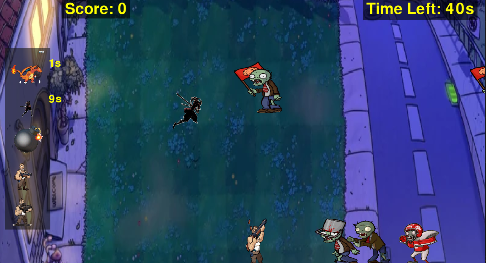
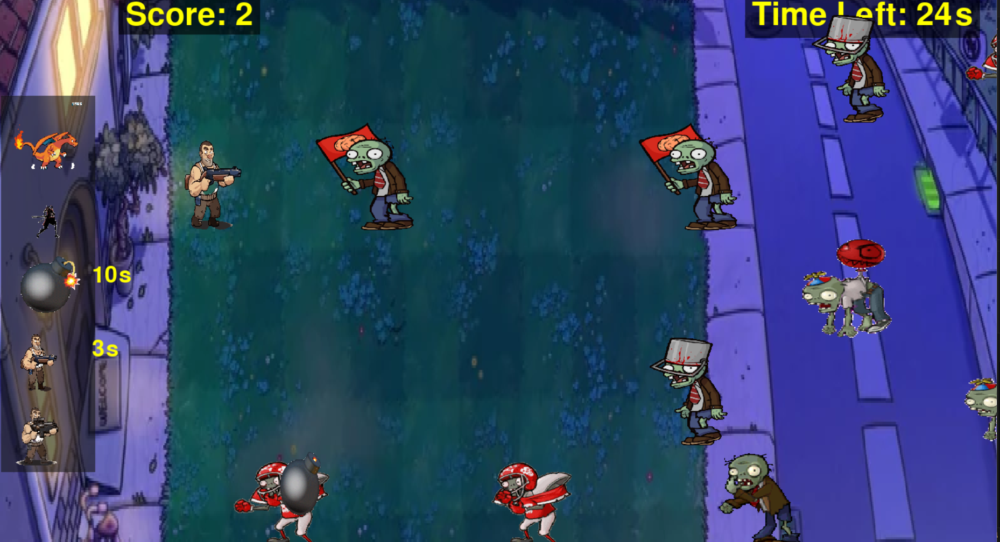
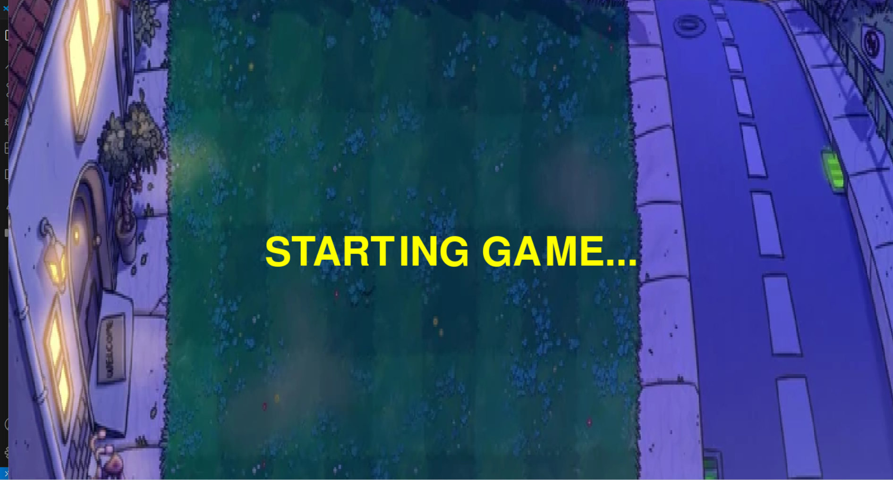
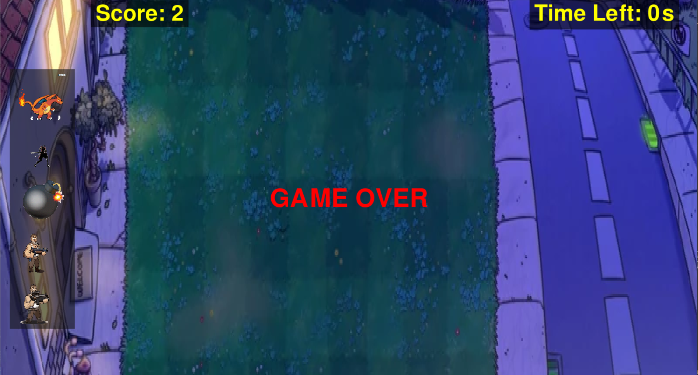

# 🧠 AI-Solving Game: Defending-Zombie-Simulation

## 🎮 Game Introduction
**Defending-Zombie-Simulation** is a **single-player** strategy game where the player must place different elements (**Sniper, Shotgun, Charizard, Samurai, Bomb**) to defend against incoming zombies, preventing them from crossing the lawn.

### 🕒 Gameplay Mechanics
- The game lasts **60 seconds**.
- Every **20 seconds**, the number of incoming zombies increases.
- Zombies will **attack** the placed elements.
- For a detailed breakdown of the game mechanics, refer to `game.txt`.



---

## 🤖 AI Game-Playing Agent
I have developed an **AI-powered agent** trained on **50+ test cases** to play the game efficiently, maximizing the **winning probability**. 

### 🧩 AI Strategy
- The agent uses **heuristic analysis** at each frame to make **quick and efficient decisions**.
- Various **utility functions** help in making optimized decisions.
- For detailed working of the AI agent, refer to `agent.txt`.



---

## 🔥 Features
### 1️⃣ Single-Player Mode
- The game can be played **manually** or by the **AI agent**.
- Modify `game_settings.py` to switch between modes:
  - **agent_play = 1** → AI agent plays the game.
  - **agent_play = 0** → Player controls the game manually.

### 2️⃣ Graphical User Interface (GUI)
- The game features a **user-friendly interface** developed using **Pygame**.
- `assets.py` contains **GIFs and sprite frames** for realistic zombie and weapon movements.
- **Customizable zombie appearance** to enhance the experience.

### 3️⃣ Legal Moves
- Guns can only be placed on the **5×5 green lawn**.

---

## 📜 Game Rules
1. **Initial State**
   
2. **Game Duration**
   - The game runs for **60 seconds**, and the player must prevent zombies from crossing the lawn.
   - If a zombie breaches the lawn → **Game Over**.
   - 
3. **Legal Moves**
   - Weapons can **only** be placed on the **5×5 green lawn**.
4. **Controls**
   - Select a gun from the **selection bar** and place it on the lawn.
   - The score is displayed as **the number of zombies killed**.

---

## 🛠️ Installation Guide
1. **Clone the repository**:
   ```sh
   git clone https://github.com/Chaitanyakotipalli/AI-Game-Solving-Agent
   cd AI_GAME_AGENT
   ```
2. **Install dependencies**:
   ```sh
   pip install pygame
   ```
3. **Run the game**:
   ```sh
   python main_game.py
   ```

---

## 🚀 Future Enhancements
- **Integrate Reinforcement Learning** to improve AI adaptability.
- **Train the AI on more test cases** and expand the game environment.
- **Enhance UI/UX** with better graphics and interactive elements.
- **Implement real-time gameplay analytics** for deeper insights.

---

*Happy gaming! 🚀🧠🎮*

